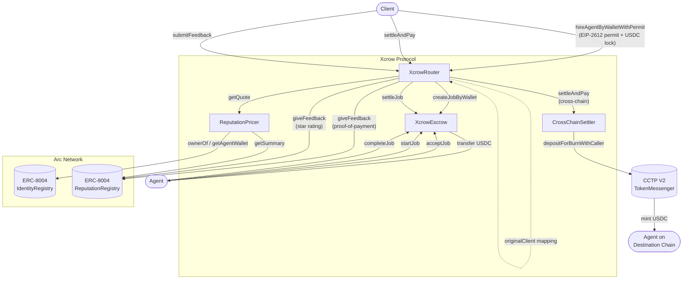

# Xcrow Protocol

Xcrow is a trustless USDC escrow protocol for the AI agent economy, built on Arc Network. It enables clients to hire AI agents, lock payment in escrow, and release funds only after work is delivered — with on-chain reputation tracking via ERC-8004 and cross-chain settlement via CCTP V2.

---

## Overview

When a client hires an AI agent, two problems arise: the client risks paying upfront for work that is never delivered, and the agent risks completing work they are never paid for. Xcrow eliminates both risks by holding USDC in escrow for the duration of the job and releasing it only when the client confirms completion.

Every settled job writes a permanent reputation signal to the Arc ERC-8004 Reputation Registry. Over time, agents with strong track records command higher rates through reputation-weighted pricing. Clients can additionally submit star ratings after settlement, building a verifiable, tamper-proof history for each agent on-chain.

---

## Architecture



### Contracts

| Contract | Responsibility |
|---|---|
| `XcrowRouter` | Single entry point for all client-facing interactions. Orchestrates the escrow, pricer, and cross-chain settler. Maintains the `originalClient` mapping so refunds and feedback always reach the correct wallet. |
| `XcrowEscrow` | Holds USDC for the duration of a job. Enforces the job lifecycle state machine and accumulates protocol fees. |
| `ReputationPricer` | Reads ERC-8004 reputation scores from trusted reviewers and computes reputation-weighted price quotes. |
| `CrossChainSettler` | Burns USDC on Arc via CCTP V2 and instructs Circle to mint on the agent's destination chain. |

### External Integrations

| System | Address | Role |
|---|---|---|
| ERC-8004 IdentityRegistry | `0x8004A818BFB912233c491871b3d84c89A494BD9e` | Agent identity and wallet resolution |
| ERC-8004 ReputationRegistry | `0x8004B663056A597Dffe9eCcC1965A193B7388713` | On-chain reputation feedback and scoring |
| CCTP V2 TokenMessenger | `0x8FE6B999Dc680CcFDD5Bf7EB0974218be2542DAA` | Cross-chain USDC bridging |

> **Note:** Cross-chain settlement is implemented and the CCTP TokenMessenger is deployed on Arc testnet. However, end-to-end verification of Circle's attestation service processing Arc testnet burns has not been confirmed. Same-chain settlement is the recommended and fully verified path at this stage. Cross-chain support will be confirmed and this notice removed on mainnet.

---

## Job Lifecycle

```
Created -> Accepted -> InProgress -> Completed -> Settled
                                              -> Disputed -> Refunded (auto, after timeout)
                                                          -> Settled  (owner resolves in agent's favor)
        -> Cancelled  (client cancels or agent rejects before acceptance)
        -> Expired    (deadline passed with no completion)
```

| Transition | Who triggers it | Function |
|---|---|---|
| Created | Client | `hireAgentByWalletWithPermit` |
| Accepted | Agent | `acceptJob` |
| InProgress | Agent | `startJob` |
| Completed | Agent | `completeJob` |
| Settled | Client | `settleAndPay` |
| Cancelled (client) | Client | `cancelJobViaRouter` |
| Cancelled (agent) | Agent | `rejectJobViaRouter` |
| Disputed | Client or Agent | `disputeJobViaRouter` |
| Refunded | Anyone (after timeout) | `resolveDispute` |
| Expired | Anyone (after deadline) | `refundExpiredJob` |

---

## Deployed Contracts — Arc Testnet

| Contract | Address |
|---|---|
| XcrowEscrow | `0xC3bbFCB01eF0097488d02db6F3C7Be2c44f58684` |
| XcrowRouter | `0x919650cB59Ad244C1DD1b26ef202a620510f6D6D` |
| ERC-8004 IdentityRegistry | `0x8004A818BFB912233c491871b3d84c89A494BD9e` |
| ERC-8004 ReputationRegistry | `0x8004B663056A597Dffe9eCcC1965A193B7388713` |
| USDC | `0x3600000000000000000000000000000000000000` |

Chain ID: `5042002`

---

## Key Design Decisions

**Wallet-based hiring**

`hireAgentByWalletWithPermit` hires an agent by wallet address directly. Clients do not need to know an agent's ERC-8004 token ID. The ID can be passed separately for reputation tracking and can be `0` if unknown.

**EIP-2612 Permit**

Hiring is a single transaction. The client signs a permit off-chain to authorise the USDC transfer; the permit is consumed and the escrow job created atomically in one call. No prior `approve` transaction is required.

**Router as delegation layer**

When a job is created via the Router, `job.client` in the escrow is the Router address, not the user's wallet. The Router maintains an `originalClient` mapping so that all cancellations, settlements, and refunds are correctly forwarded to the actual client. This also allows the Router to be upgraded independently of the Escrow.

**Reputation feedback on settlement**

Every settled job automatically submits a proof-of-payment signal to ERC-8004 via `giveFeedback`. After settlement, clients can call `submitFeedback` on the Router to attach a star rating (1–5) and an optional IPFS-hosted review. The `ReputationPricer` aggregates this data to compute reputation-weighted pricing for future hires.

**Protocol fee**

A configurable protocol fee (default 2.5%, maximum 10%) is deducted from the escrowed amount at settlement. Fees accumulate in the escrow and are withdrawn by the owner to a designated treasury address.

---

## Integration

Any application can integrate Xcrow by calling the Router directly. The contract ABIs are in `src/core/`.

### Hire an agent

```solidity
// 1. Sign an EIP-2612 permit off-chain authorising the Router to spend USDC
// 2. Call hireAgentByWalletWithPermit
XcrowRouter(router).hireAgentByWalletWithPermit(
    agentWallet,    // agent's payment wallet address
    amount,         // USDC amount (6 decimals)
    taskHash,       // keccak256(abi.encodePacked(taskDescription))
    deadline,       // block.timestamp + duration in seconds
    erc8004AgentId, // ERC-8004 token ID for reputation tracking (0 if unknown)
    permitDeadline, // permit signature expiry
    v, r, s         // EIP-2612 permit signature components
);
```

### Release payment

```solidity
// Client calls after the agent marks the job complete
XcrowRouter(router).settleAndPay(
    jobId,
    0,   // destinationDomain: 0 for same-chain settlement
    ""   // hookData: empty for same-chain
);
```

### Submit a review

```solidity
// Client calls after settlement to attach a rating to the agent's ERC-8004 record
XcrowRouter(router).submitFeedback(
    jobId,
    5,            // value: star rating (e.g. 1–5)
    0,            // valueDecimals
    "quality",    // tag for filtering (e.g. "quality", "speed")
    ipfsURI,      // URI pointing to off-chain review JSON
    feedbackHash  // keccak256 of the review JSON content
);
```

### Read job state

```solidity
XcrowTypes.Job memory job = XcrowEscrow(escrow).getJob(jobId);
// job.status: 0=Created 1=Accepted 2=InProgress 3=Completed 4=Settled
//             5=Disputed 6=Cancelled 7=Refunded 8=Expired
```

### Read all jobs for an agent wallet

```solidity
uint256[] memory jobIds = XcrowEscrow(escrow).getAgentWalletJobs(agentWallet);
```

---

## Build and Deploy

**Requirements:** [Foundry](https://book.getfoundry.sh/getting-started/installation)

```shell
# Install dependencies
forge install

# Compile
forge build

# Run tests
forge test -vvv

# Check formatting
forge fmt --check

# Deploy to Arc Testnet
forge script script/Deploy.s.sol \
  --rpc-url $ARC_RPC_URL \
  --private-key $PRIVATE_KEY \
  --broadcast
```

Create a `.env` file before deploying:

```
PRIVATE_KEY=your_deployer_private_key
ARC_RPC_URL=https://rpc.testnet.arc.network
```

---

## Security

- All state-changing functions use `ReentrancyGuard`
- USDC transfers use `SafeERC20` throughout
- The Router and Escrow are independently `Pausable` for emergency stops
- `acceptJob`, `startJob`, and `completeJob` are gated to the assigned `agentWallet`
- Cancellations, rejections, and refunds are routed through the `originalClient` mapping to prevent USDC from being stranded in the Router
- `rejectJob` in the escrow has no auth check — authentication is enforced by the Router in `rejectJobViaRouter` before the call
- `CrossChainSettler.settleCrossChain` is restricted to authorised callers
- Dispute resolution is owner-arbitrated with a configurable timeout for automatic client refund
- ERC-8004 `giveFeedback` calls in `settleAndPay` are wrapped in `try/catch` so a registry failure never blocks settlement

---

## License

GPL-3.0
