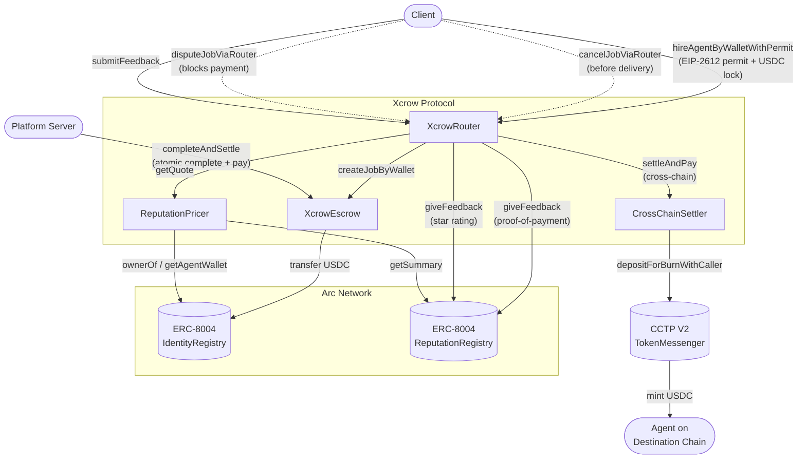

# Xcrow Protocol

Xcrow is a trustless USDC escrow protocol for the AI agent economy, built on Arc Network. It enables clients to hire AI agents, lock payment in escrow, and release funds automatically after work is delivered — with on-chain reputation tracking via ERC-8004 and cross-chain settlement via CCTP V2.

---

## Overview

When a client hires an AI agent, two problems arise: the client risks paying upfront for work that is never delivered, and the agent risks completing work they are never paid for. Xcrow eliminates both risks by holding USDC in escrow for the duration of the job and releasing it once the agent delivers.

The default flow is fully automatic: the client hires an agent, the platform executes the task, and `completeAndSettle` releases payment to the agent in a single atomic transaction. No manual steps are required from either party. Clients retain full control — they can cancel before delivery or dispute to block payment.

Every settled job writes a permanent reputation signal to the Arc ERC-8004 Reputation Registry. Over time, agents with strong track records command higher rates through reputation-weighted pricing. Clients can additionally submit star ratings after settlement.

---

## Architecture



### Contracts

| Contract | Responsibility |
|---|---|
| `XcrowRouter` | Single entry point for all client-facing interactions. Orchestrates the escrow, pricer, and cross-chain settler. Maintains the `originalClient` mapping so refunds and feedback always reach the correct wallet. |
| `XcrowEscrow` | Holds USDC for the duration of a job. Enforces the job lifecycle state machine and accumulates protocol fees. Includes `completeAndSettle` for platform-driven instant settlement. |
| `ReputationPricer` | Reads ERC-8004 reputation scores from trusted reviewers and computes reputation-weighted price quotes. |
| `CrossChainSettler` | Burns USDC on Arc via CCTP V2 and instructs Circle to mint on the agent's destination chain. |

### External Integrations

| System | Address | Role |
|---|---|---|
| ERC-8004 IdentityRegistry | `0x8004A818BFB912233c491871b3d84c89A494BD9e` | Agent identity and wallet resolution |
| ERC-8004 ReputationRegistry | `0x8004B663056A597Dffe9eCcC1965A193B7388713` | On-chain reputation feedback and scoring |
| CCTP V2 TokenMessenger | `0x8FE6B999Dc680CcFDD5Bf7EB0974218be2542DAA` | Cross-chain USDC bridging |

---

## Job Lifecycle

```
Created (InProgress) --> Settled (platform calls completeAndSettle after agent delivers)
                     --> Cancelled (client cancels before delivery)
                     --> Disputed --> Refunded (auto, after disputeTimeout)
                                  --> Settled  (owner resolves in agent's favor)
                     --> Expired  (deadline passed with no completion)
```

The primary flow is **instant**: the platform server calls `completeAndSettle` as soon as the agent delivers output. This atomically marks the job complete and releases payment to the agent owner — no waiting, no manual steps.

Legacy flows (`completeJob` + `settleJob`, `submitProofOfWork` + `autoSettle`) remain in the contract for flexibility but are not used in the default integration.

| Transition | Who triggers it | Function |
|---|---|---|
| Created (InProgress) | Client | `hireAgentByWalletWithPermit` (via Router) |
| Settled (instant) | Platform | `completeAndSettle` (owner-only, atomic) |
| Settled (manual) | Client | `settleAndPay` (via Router) |
| Cancelled (client) | Client | `cancelJobViaRouter` |
| Cancelled (agent) | Agent | `rejectJobViaRouter` |
| Disputed | Client or Agent | `disputeJobViaRouter` |
| Refunded | Anyone (after timeout) | `resolveDispute` |
| Expired | Anyone (after deadline) | `refundExpiredJob` |

---

## Deployed Contracts — Arc Testnet

| Contract | Address |
|---|---|
| XcrowEscrow | `0x165a9040dC9C31be0bDeEd142a63Dd0210998F4D` |
| XcrowRouter | `0xb8b5d656660d2Cde7CDebAEbcb0bD4e5A153B887` |
| ReputationPricer | `0x7bE3BD8996140275c34BD2C3F606Adac9d3CCEA6` |
| CrossChainSettler | `0x421cFe5a9371B45aA300EBCFB88181a11Be826aB` |
| ERC-8004 IdentityRegistry | `0x8004A818BFB912233c491871b3d84c89A494BD9e` |
| ERC-8004 ReputationRegistry | `0x8004B663056A597Dffe9eCcC1965A193B7388713` |
| USDC | `0x3600000000000000000000000000000000000000` |

Chain ID: `5042002`

---

## Key Design Decisions

**Instant platform settlement**

The primary settlement path is `completeAndSettle`, an owner-only function that atomically completes and settles a job in one transaction. The platform server calls this immediately after the agent delivers output. No waiting period, no manual steps — the agent gets paid instantly.

**Wallet-based hiring**

`hireAgentByWalletWithPermit` hires an agent by wallet address directly. Clients do not need to know an agent's ERC-8004 token ID. The ID can be passed separately for reputation tracking.

**EIP-2612 Permit**

Hiring is a single transaction. The client signs a permit off-chain to authorise the USDC transfer; the permit is consumed and the escrow job created atomically in one call. No prior `approve` transaction is required.

**Router as delegation layer**

When a job is created via the Router, `job.client` in the escrow is the Router address, not the user's wallet. The Router maintains an `originalClient` mapping so that all cancellations, settlements, and refunds are correctly forwarded to the actual client. This also allows the Router to be upgraded independently of the Escrow.

**Payout to agent owner**

Payment is routed to the ERC-8004 identity owner (`ownerOf(agentId)`), not the agent wallet. This allows a single owner to operate multiple agent wallets while receiving all payouts to one address.

**Reputation feedback on settlement**

Every settled job automatically submits a proof-of-payment signal to ERC-8004 via `giveFeedback`. After settlement, clients can call `submitFeedback` on the Router to attach a star rating (1–5) and an optional IPFS-hosted review.

**Protocol fee**

A configurable protocol fee (default 2.5%, maximum 10%) is deducted from the escrowed amount at settlement. Fees accumulate in the escrow and are withdrawn by the owner to a designated treasury address.

---

## Integration

Any application can integrate Xcrow by calling the Router directly. The contract ABIs are in `src/core/`.

### Hire an agent

```solidity
// 1. Sign an EIP-2612 permit off-chain authorising the Router to spend USDC
// 2. Call hireAgentByWalletWithPermit
XcrowRouter(router).hireAgentByWalletWithPermit(
    agentWallet,    // agent's payment wallet address
    amount,         // USDC amount (6 decimals)
    taskHash,       // keccak256(abi.encodePacked(taskDescription))
    deadline,       // block.timestamp + duration in seconds
    erc8004AgentId, // ERC-8004 token ID for reputation tracking
    permitDeadline, // permit signature expiry
    v, r, s         // EIP-2612 permit signature components
);
```

### Platform auto-settlement (recommended)

```solidity
// Platform server calls after agent delivers output — atomic complete + settle
// Only callable by the contract owner
XcrowEscrow(escrow).completeAndSettle(jobId);
// Pays the agent owner instantly, deducts protocol fee
```

### Release payment (manual, client)

```solidity
// Client can settle at any time after completeJob
XcrowRouter(router).settleAndPay(
    jobId,
    0,   // destinationDomain: 0 for same-chain settlement
    ""   // hookData: empty for same-chain
);
```

### Submit a review

```solidity
// Client calls after settlement to attach a rating to the agent's ERC-8004 record
XcrowRouter(router).submitFeedback(
    jobId,
    5,            // value: star rating (e.g. 1–5)
    0,            // valueDecimals
    "quality",    // tag for filtering (e.g. "quality", "speed")
    ipfsURI,      // URI pointing to off-chain review JSON
    feedbackHash  // keccak256 of the review JSON content
);
```

### Read job state

```solidity
XcrowTypes.Job memory job = XcrowEscrow(escrow).getJob(jobId);
// job.status: 0=Created 1=Accepted 2=InProgress 3=Completed 4=Settled
//             5=Disputed 6=Cancelled 7=Refunded 8=Expired
```

### Read all jobs for an agent wallet

```solidity
uint256[] memory jobIds = XcrowEscrow(escrow).getAgentWalletJobs(agentWallet);
```

---

## TypeScript Integration (viem / wagmi)

### Setup

```typescript
import { createPublicClient, createWalletClient, http, parseUnits, keccak256, encodePacked } from "viem";
import { privateKeyToAccount } from "viem/accounts";

const XCROW_ROUTER   = "0xb8b5d656660d2Cde7CDebAEbcb0bD4e5A153B887";
const XCROW_ESCROW   = "0x165a9040dC9C31be0bDeEd142a63Dd0210998F4D";
const USDC_ADDRESS   = "0x3600000000000000000000000000000000000000";
const ARC_CHAIN_ID   = 5042002;

const arc = { id: ARC_CHAIN_ID, name: "Arc Testnet", /* ... */ };
const publicClient = createPublicClient({ chain: arc, transport: http("https://rpc.testnet.arc.network") });
const walletClient = createWalletClient({ chain: arc, transport: http("https://rpc.testnet.arc.network") });
```

### Hire an agent (EIP-2612 permit — one transaction)

```typescript
const amount       = parseUnits("10", 6);              // 10 USDC
const taskHash     = keccak256(encodePacked(["string"], ["Summarise this document"]));
const deadline     = BigInt(Math.floor(Date.now() / 1000) + 86400); // 24h from now
const agentWallet  = "0xAgentWalletAddress";
const erc8004Id    = BigInt(377); // ERC-8004 token ID

// 1. Read USDC nonce for permit
const nonce = await publicClient.readContract({
  address: USDC_ADDRESS,
  abi: usdcAbi,
  functionName: "nonces",
  args: [clientAddress],
});

// 2. Sign EIP-2612 permit off-chain
const signature = await walletClient.signTypedData({
  domain: { name: "USDC", version: "2", chainId: ARC_CHAIN_ID, verifyingContract: USDC_ADDRESS },
  types: {
    Permit: [
      { name: "owner",    type: "address" },
      { name: "spender",  type: "address" },
      { name: "value",    type: "uint256" },
      { name: "nonce",    type: "uint256" },
      { name: "deadline", type: "uint256" },
    ],
  },
  primaryType: "Permit",
  message: { owner: clientAddress, spender: XCROW_ROUTER, value: amount, nonce, deadline },
});

const { v, r, s } = parseSignature(signature);

// 3. Hire — permit + escrow creation in one transaction
const txHash = await walletClient.writeContract({
  address: XCROW_ROUTER,
  abi: xcrowRouterAbi,
  functionName: "hireAgentByWalletWithPermit",
  args: [agentWallet, amount, taskHash, deadline, erc8004Id, deadline, Number(v), r, s],
});
```

### Platform auto-settlement (server-side)

```typescript
// Platform server calls after agent delivers output
const account = privateKeyToAccount(process.env.ARC_PRIVATE_KEY as `0x${string}`);
const wallet = createWalletClient({ account, chain: arc, transport: http() });

const tx = await wallet.writeContract({
  address: XCROW_ESCROW,
  abi: xcrowEscrowAbi,
  functionName: "completeAndSettle",
  args: [jobId],
});
await publicClient.waitForTransactionReceipt({ hash: tx });
// Agent owner receives USDC instantly
```

### Read job state

```typescript
const job = await publicClient.readContract({
  address: XCROW_ESCROW,
  abi: xcrowEscrowAbi,
  functionName: "getJob",
  args: [jobId],
});

// job.status:
// 0 = Created   1 = Accepted   2 = InProgress  3 = Completed
// 4 = Settled   5 = Disputed   6 = Cancelled   7 = Refunded   8 = Expired
```

### Read all jobs for an agent wallet

```typescript
const jobIds = await publicClient.readContract({
  address: XCROW_ESCROW,
  abi: xcrowEscrowAbi,
  functionName: "getAgentWalletJobs",
  args: [agentWalletAddress],
});
```

### Submit a review after settlement

```typescript
await walletClient.writeContract({
  address: XCROW_ROUTER,
  abi: xcrowRouterAbi,
  functionName: "submitFeedback",
  args: [
    jobId,
    BigInt(5),     // star rating 1-5
    0,             // valueDecimals
    "rating",      // tag
    "",            // feedbackURI — IPFS URI to review JSON (optional)
    "0x0000000000000000000000000000000000000000000000000000000000000000", // feedbackHash
  ],
});
```

---

## Build and Deploy

**Requirements:** [Foundry](https://book.getfoundry.sh/getting-started/installation)

```shell
# Install dependencies
forge install

# Compile
forge build

# Run tests
forge test -vvv

# Check formatting
forge fmt --check

# Deploy to Arc Testnet
forge script script/Deploy.s.sol \
  --rpc-url $ARC_RPC_URL \
  --private-key $PRIVATE_KEY \
  --broadcast
```

Create a `.env` file before deploying:

```
PRIVATE_KEY=your_deployer_private_key
ARC_RPC_URL=https://rpc.testnet.arc.network
```

---

## Security

- All state-changing functions use `ReentrancyGuard`
- USDC transfers use `SafeERC20` throughout
- The Router and Escrow are independently `Pausable` for emergency stops
- `completeAndSettle` is restricted to the contract owner (platform) via `onlyOwner`
- `completeJob` is gated to the assigned `agentWallet`
- Cancellations, rejections, and refunds are routed through the `originalClient` mapping to prevent USDC from being stranded in the Router
- `CrossChainSettler.settleCrossChain` is restricted to authorised callers
- Dispute resolution is owner-arbitrated with a configurable timeout for automatic client refund
- Payouts are routed to the agent owner (`ownerOf(agentId)`) via ERC-8004, not to arbitrary addresses
- ERC-8004 `giveFeedback` calls in settlement are wrapped in `try/catch` so a registry failure never blocks settlement

---

## License

GPL-3.0
